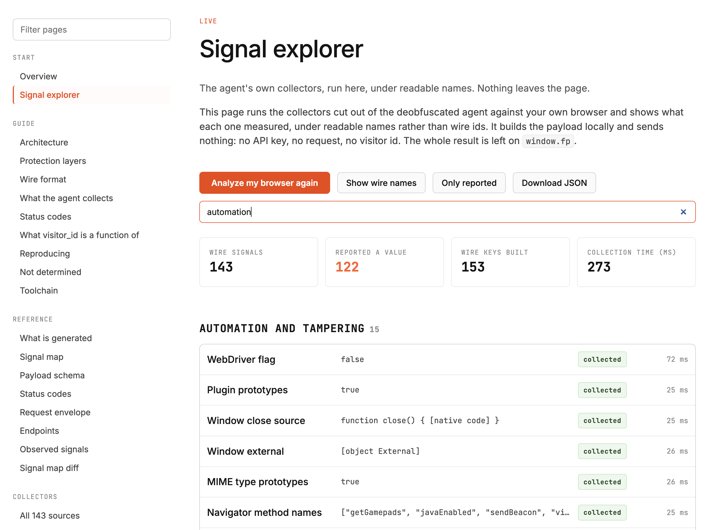

<p align="center">
  <picture>
    <source media="(prefers-color-scheme: dark)" srcset="docs/logo-dark.svg" />
    <source media="(prefers-color-scheme: light)" srcset="docs/logo.svg" />
    
  </picture>
</p>

<h3 align="center">Fingerprint Pro v4, deobfuscated and documented</h3>

<p align="center">
  <b>143 signals named. The bundle unpacked. The wire format decoded.</b>
</p>

<p align="center">
  <b><a href="https://proofofbots.github.io/fingerprint-pro-internals/explorer.html">Run it on your browser</a></b> ·
  <b><a href="https://proofofbots.github.io/fingerprint-pro-internals/">Read the docs</a></b> ·
  <a href="https://proofofbots.github.io/fingerprint-pro-internals/reference/signals.html">Signal map</a> ·
  <a href="https://proofofbots.github.io/fingerprint-pro-internals/slices/">Collector sources</a>
</p>

---

| | |
| --- | --- |
| [**143 signals, one row each**](https://proofofbots.github.io/fingerprint-pro-internals/reference/signals.html) | surfaces touched, status codes, constants compared, value shape |
| [**The agent, readable**](https://proofofbots.github.io/fingerprint-pro-internals/repo/agent.html) | CRC32 names resolved, tables decrypted, wrappers folded, bindings renamed, hash-pinned |
| [**Every collector as its own file**](https://proofofbots.github.io/fingerprint-pro-internals/slices/) | one signal plus only the helpers it reaches, instead of a 200 KB bundle |
| [**The collectors, runnable**](https://proofofbots.github.io/fingerprint-pro-internals/repo/collector.html) | `collect`, `buildPayload`, `frame`, `send` from a console. No agent, no network |
| [**Wire format, end to end**](https://proofofbots.github.io/fingerprint-pro-internals/03-wire-format.html) | JSON to bytes, deflate-raw over 1024, sealed with a key that ships inside the frame |
| [**What `visitor_id` is a function of**](https://proofofbots.github.io/fingerprint-pro-internals/06-identity.html) | 7 fields break a match alone, `s56` is a bearer token, not a fingerprint |

<p align="center">
  <a href="https://proofofbots.github.io/fingerprint-pro-internals/explorer.html">
    
  </a>
</p>

# Akamai solver + other tools
For Akamai, and other solvers, check out this repo: https://github.com/proofofbots/web-re-toolkit

## The site

The whole repository is published at
[proofofbots.github.io/fingerprint-pro-internals](https://proofofbots.github.io/fingerprint-pro-internals/):
the guide, every generated map as a filterable table, all 143 collector sources syntax highlighted,
and the live explorer. `npm run site` builds it into [`docs/`](docs/), which is what GitHub Pages
serves from `main`. Open `docs/index.html` over HTTP to preview a build locally.

## Quickstart

```bash
npm install
npm run fetch      # download the pinned bundle, verify its hash
npm run all        # deobfuscate, verify, regenerate every map
npm run site       # rebuild the documentation site into docs/
npm run capture    # serve the capture page, open it once per browser
```

To read rather than run, start at
[the signal map](https://proofofbots.github.io/fingerprint-pro-internals/reference/signals.html) for
the inventory and
[the collector sources](https://proofofbots.github.io/fingerprint-pro-internals/slices/) for the code
behind any single signal.

To watch the agent on a live site, paste [`spy/fpspy.js`](spy/fpspy.js) into DevTools.

To run the collectors with no agent and no network, open
[the explorer](https://proofofbots.github.io/fingerprint-pro-internals/explorer.html), or serve the
repository and open [`collector/index.html`](collector/index.html) for the raw table.

Everything here describes one pinned build: `jsl/4.0.0`, sha256 `250c7dfe…`, fetched 2026-08-07. The
tenant ships new builds and the paths rotate. `npm run fetch` checks the pin and `npm run diff` says
what changed.

## Layout

| directory | what is in it |
| --- | --- |
| [`docs/`](docs/) | the writeup, plus the generated site GitHub Pages serves |
| [`agent/`](agent/) | the deobfuscated bundle and worker, the decrypted string tables, the pin |
| [`reference/`](reference/) | generated maps: signals, slices, schema, envelope, codes, endpoints, observed |
| [`collector/`](collector/) | `fp-collect.js`, the collectors and codec as one plain module |
| [`site/`](site/) | source of the generated site |
| [`spy/`](spy/) | the DevTools instrumentation script |
| [`captures/`](captures/) | three browser captures of the pinned build |
| [`profiles/`](profiles/) | a device profile that compiles to a payload |
| [`evidence/`](evidence/) | raw rows behind the identity and attribution findings |
| [`tools/`](tools/) | the toolchain, one job per file |
| `artifacts/` | everything generated that is not committed |

## What the analysis found

- Both protection layers come apart offline. Property names are CRC32 constants over DOM
  identifiers, which a dictionary resolves; the four string tables that key off live browser state
  key off property *names*, which the same dictionary already recovers.
  [02-obfuscation](https://proofofbots.github.io/fingerprint-pro-internals/02-obfuscation.html)
- The agent names its own signals. Each module registers a `sources` table mapping the wire id to the
  collector, so the map is the agent's labels, not assigned ones. 143 ids, 4 of them scheduled first
  because they are slow.
  [01-architecture](https://proofofbots.github.io/fingerprint-pro-internals/01-architecture.html),
  [04-collection](https://proofofbots.github.io/fingerprint-pro-internals/04-collection.html)
- The wire format is JSON over bytes, deflate-raw over 1024 bytes, then framed with a key that ships
  inside the frame.
  [03-wire-format](https://proofofbots.github.io/fingerprint-pro-internals/03-wire-format.html)
- `s56`, the blob the server issues over the GET leg and the client replays, is a bearer token. Any
  payload carrying a bound one answers as that visitor whatever the device reports. With it empty,
  seven fields break the identity match on their own, and the rest hold until six groups of them move
  at once. [06-identity](https://proofofbots.github.io/fingerprint-pro-internals/06-identity.html)
- Across Chrome, Firefox and Safari on one machine, 58 of the 143 signals report a different value
  and the remaining 85 are identical. The static read and the captures disagree nowhere.
  [04-collection](https://proofofbots.github.io/fingerprint-pro-internals/04-collection.html)

## Docs

1. [Architecture](https://proofofbots.github.io/fingerprint-pro-internals/01-architecture.html) — modules, stages, worker, request legs, symbol table
2. [Protection layers](https://proofofbots.github.io/fingerprint-pro-internals/02-obfuscation.html) — CRC32 names, encrypted tables, what the passes do
3. [Wire format](https://proofofbots.github.io/fingerprint-pro-internals/03-wire-format.html) — codec, frame, envelope, request path
4. [What the agent collects](https://proofofbots.github.io/fingerprint-pro-internals/04-collection.html) — the signal inventory and how to read it
5. [Status codes](https://proofofbots.github.io/fingerprint-pro-internals/05-status-codes.html) — the 11 codes and what they mean
6. [Identity](https://proofofbots.github.io/fingerprint-pro-internals/06-identity.html) — what `visitor_id` is a function of
7. [Reproducing](https://proofofbots.github.io/fingerprint-pro-internals/07-reproducing.html) — the pinned target and every command
8. [Not determined](https://proofofbots.github.io/fingerprint-pro-internals/08-not-determined.html) — the limits of all of the above
9. [Toolchain](https://proofofbots.github.io/fingerprint-pro-internals/09-toolchain.html) — every tool, flag by flag

## Scope

The shipped bundle is not redistributed here. `agent/agent.clean.js` is derived work: the same
program with the obfuscation removed and every binding renamed. `agent/pin.json` carries the hash of
the original so anyone can fetch it and check.

The captures and evidence files are runs against Fingerprint's own public demo tenant with its public
API key. Third-party storage entries, proxy sessions and IP addresses are stripped before anything
lands in the tree, and the stored frames are rebuilt from the published payloads rather than kept as
sent.

## License and contact

Public domain, [Unlicense](LICENSE). Use it however you like, anywhere, commercially or not, with no
attribution required.

"Fingerprint" and the fingerprint mark are trademarks of Fingerprint. This project is unofficial and
not affiliated with, endorsed by or supported by them, and the logo above is a derivative of their
mark used to identify what is documented here.

Contact, including takedown and legal enquiries: proofofbot@pm.me
